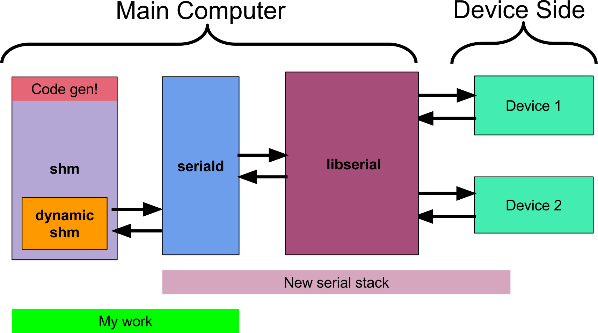

# CUAUV Serial Daemon

The serial daemon is responsible for syncing variables between the main com-
puter of CUAUV's submarines and their serial boards which control thrusters,
actuators, sensors, and other devices. The serial daemon largely is what allows
software on the main computer to query the sub’s environment and control the
sub’s behavior. This new serial stack is more modular, clean, and robust than
the previous implementation.

See my [Technical Documentation](doc/serial_daemon_aso26.pdf) for more info.

