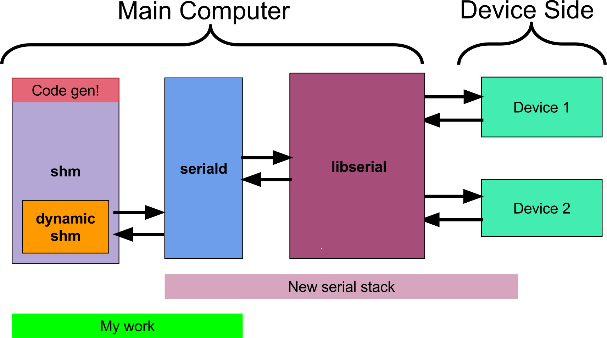
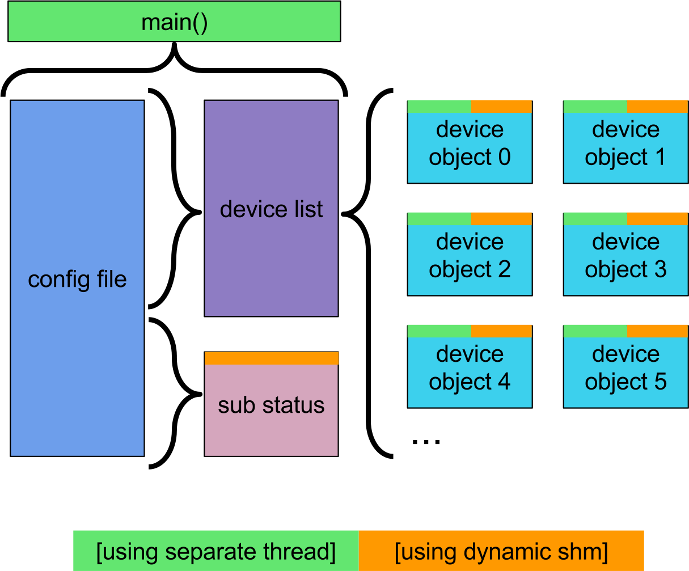
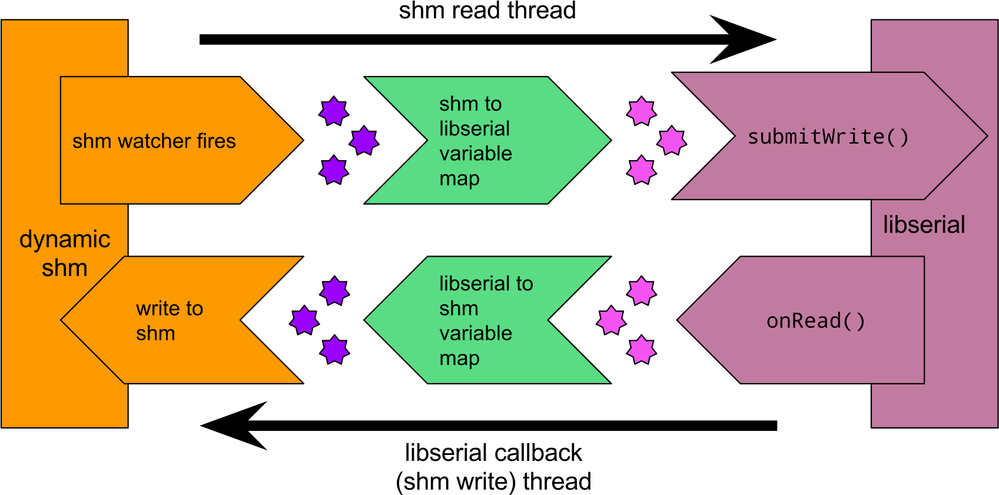

# CUAUV Serial Daemon

The serial daemon is responsible for syncing variables between the main
computer of CUAUV's submarines and their serial boards which control thrusters,
actuators, sensors, and other devices. The serial daemon is largely what allows
software on the main computer to query the sub’s environment and control the
sub’s behavior. This new serial stack is more modular, clean, and robust than
the previous implementation.

See my [Technical Documentation](doc/serial_daemon_aso26.pdf) for more info.

---

## New Serial Stack Overview

## Seriald Implementation Overview

## Seriald Device Objects

